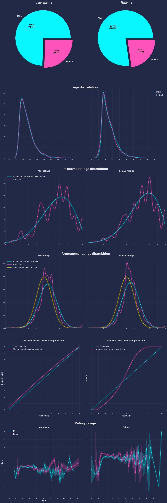

# Datasets contained in this repo are compiled from following subreddits
- `/r/rateme` - Face ratings
- `/r/ratemyface` - Face ratings
- `/r/truerateme` - Face ratings based on normal distribution with mean of 5 and std 1
- `/r/ifyuhadtopickone` - Single choice, mostly female images. ``(POTENTIALLY NSFW)``
- `/r/ranked_girls` - Ranked voting, mostly female images. ``(POTENTIALLY NSFW)``
- `/r/lineups` - Ranked voting, mostly female images. ``(POTENTIALLY NSFW)``
### Currently there is no way to download the data from annotations, but i plan to implement it son.
# Comparasion of /r/rateme and /r/truerateme

### Code is released under the MIT license, the license of images is unknown so i won't host cropped images only urls.